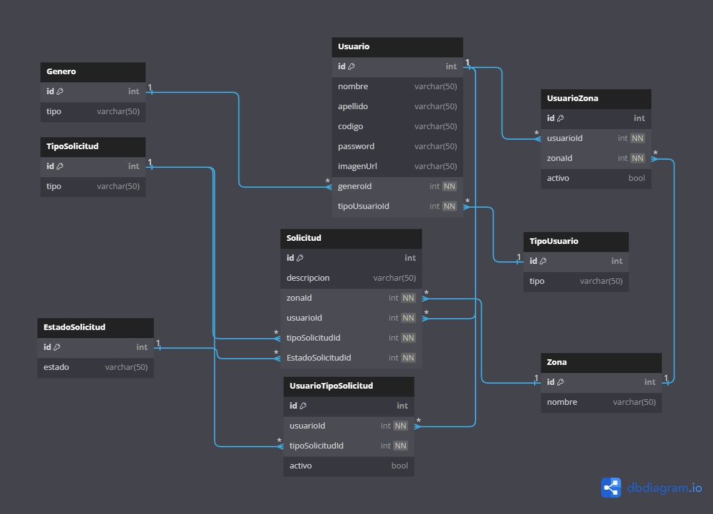

## Diagrama Base Datos

## Estructura

| Codebase              |      Descripción          |
| :-------------------- | :-----------------------: |
| [Backend](Backend)    | Codigo logica aplicación  |
| [Web](webapp)         |   Administracón web       |
| [App](movilapp)       | App movil usuario campo   |

## Ejecutar localmente

Para ejecutar la aplicación localmente es necesario ejecutar el proyecto Backend en Visual Studio y una vez arriba se corren las migraciones automaticamente y luego
copiar el enlace del api y reemplazarlos en el archivo de constants en el proyecto web y movil.

En el dispositivo movil se tiene que hacer un paso extra y es correr el comando `adb reverse tcp:PUERTO tcp:PUERTO` ya que
es necesario hacer un redireccionamiento al dispositivo movil (Para este paso tiene que tener configurado en su maquina el Android Debug Bridge). La variable `PUERTO` es el puerto generado por el proyecto Backend
al ejecutarlo el cual es la sección que va luego del localhost por ejemplo `http://localhost:5421` y luego procedemos a escribir `flutter run` en nuestra consola.

El proyecto web fue generado con `vite` y para ejecutarlo solo es necesario descargar las dependencias y escribimos el comando `npm run dev` en nuestra consola.
